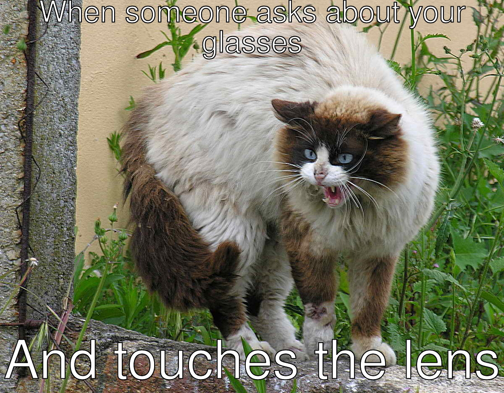

Create Meme using ImageMagick
=============================

ImageMagick can caption stock images, but it cannot make them a meme unless
_you_ provide the right text. This tool makes no attempt to make you more
popular or snarky. It only attempts to make it easier for you to magnify your
inner self.

The scripts here are simply highlighting usage patterns of the `convert`
command which are conducive to applying captions to images.

Good luck ruling the Interwebs!
 
## Dependencies
This script requires:
1. [ImageMagick](https://www.imagemagick.org/)
2. `sh` provider, e.g [bash](https://www.gnu.org/software/bash/bash.html).

## Run the Shell Script
Example:
```bash
./mkmeme cat.jpg cat-test.jpg -top "When someone asks about your glasses" -bot "And touches the lens" -tcolor white -tborder black
```

Output:

</img>

Thanks
======
ImageMagick
:  http://www.imagemagick.org/Usage/annotating/

Wikimedia
:  https://commons.wikimedia.org/wiki/File:Gato_enervado_pola_presencia_dun_can.jpg
